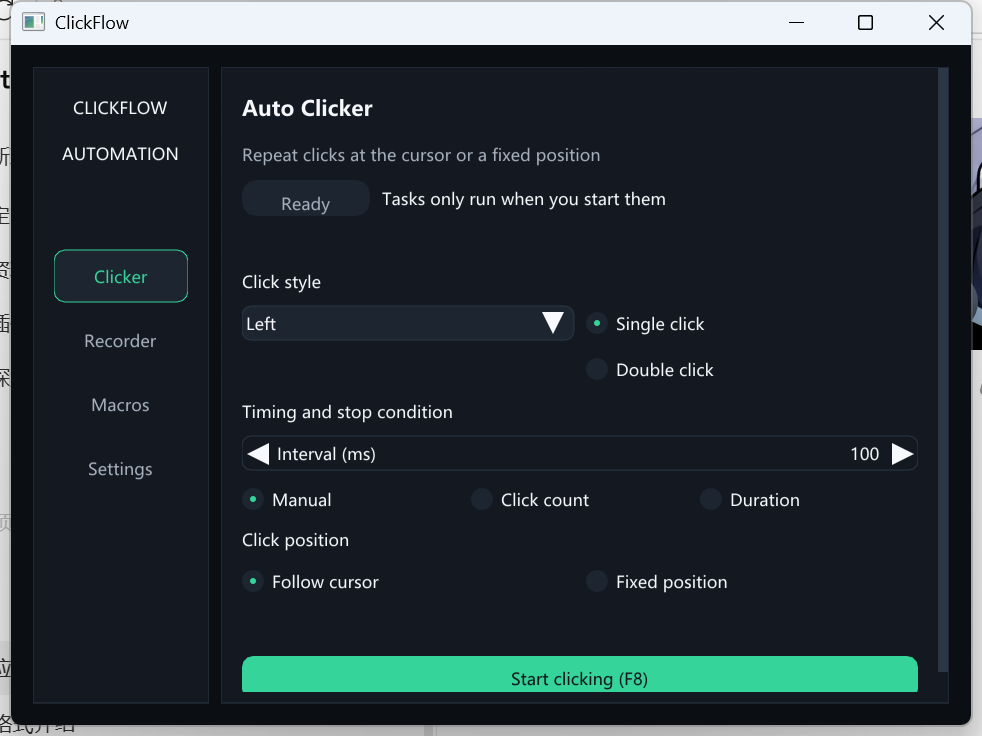

# ClickFlow

**English** | [简体中文](README.md)

ClickFlow is a local mouse automation tool for Windows 10/11 x64. It is built with C17, Win32, Direct3D 11, and Nuklear. Version 1 requires no account or subscription, includes no telemetry, and makes no network requests at runtime.



## Features

- **Auto Clicker**: left, middle, or right button; single or double click; manual, count, or duration stop conditions; cursor or fixed position.
- **Mouse Recorder**: captures mouse movement, presses, releases, clicks, and wheel input, with pause, resume, save, load, rename, delete, and variable-speed playback.
- **Visual Macro**: add, remove, duplicate, reorder, and edit actions; configure speed, repeats, and a dedicated global hotkey.
- **Settings**: dark and light themes, default click interval, start/stop hotkey, and emergency-stop hotkey.
- **Bilingual UI**: switch between English and Simplified Chinese immediately; the choice is saved locally.

`F8` starts or stops the clicker by default. `Esc` immediately stops any running task. ClickFlow never sends input on startup and only runs one clicker, recording, or macro task at a time.

## Usage

1. Open **Clicker**, choose the button, interval, stop condition, and position, then select **Start clicking** or press `F8`.
2. Open **Recorder**, enter a name, and start recording. The result can be played immediately or saved as JSON.
3. Open **Macros**, create or load a macro, add and edit actions, then run it. ClickFlow validates the current multi-monitor layout and coordinates before playback.
4. Press `Esc` if anything unexpected happens. A stop request interrupts long waits and releases mouse buttons held by ClickFlow.

### Verify click counts

Run `clickflow_click_counter.exe`, place the cursor over its test area, then start ClickFlow. The tool reports left, middle, right, and total clicks. Select **Reset**, press `R`, or press `Delete` to clear the counts.

Recordings use `kind: recording` and the suggested `.cfr.json` suffix. Macros use `kind: macro` and the suggested `.cfm.json` suffix. Both are UTF-8 JSON files with `schema_version: 1`; you choose where to store them.

Configuration is stored at `%LOCALAPPDATA%\ClickFlow\config.json`. If the file is damaged, ClickFlow moves it to `%LOCALAPPDATA%\ClickFlow\backups` and restores defaults. To uninstall, remove the application directory and this data directory. ClickFlow does not write to the registry, install a service, or configure startup tasks.

## Build

Requirements: CMake 3.24+, Ninja, and MinGW-w64 GCC. The pinned Nuklear and cJSON sources are included in the repository.

```powershell
cmake -S . -B build -G Ninja -DCMAKE_C_COMPILER=C:/mingw64/bin/gcc.exe -DCMAKE_BUILD_TYPE=Release
cmake --build build
ctest --test-dir build --output-on-failure
```

`build\clickflow.exe` is the Windows GUI application. `build\clickflow_click_counter.exe` is the click counter test tool. Distributions should include `README.md`, `README.en.md`, `LICENSES.md`, and the licenses in `third_party`.

## Current limitations

- Version 1 records and sends mouse input only. It does not record keyboard input, perform image recognition, or target background windows.
- Playback depends on the recorded virtual desktop layout. ClickFlow refuses playback after the display layout changes to reduce the chance of clicking the wrong place.
- Programs running as administrator may reject input from a normally privileged ClickFlow process.
- If another program owns a global hotkey, choose a different shortcut in **Settings**.
- Version 1 has no cloud sync, script execution, updater, or AI API. The planned AI-assisted macro workflow is documented in [`docs/ROADMAP.md`](docs/ROADMAP.md).

ClickFlow source code is available under the [MIT License](LICENSE). See [`LICENSES.md`](LICENSES.md) for third-party components and their licenses.
